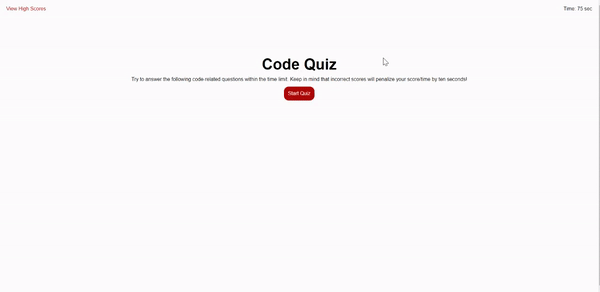

#challenge-4-Code-Quiz

## Description

This code quiz has been created to help prepare for future coding assessments. The code quiz consists of 4 pages: start, quiz, end, and scores.

The start page consists of a header and short details paragraph describing the time penalty for incorrect scores. The button to start the quiz and view the scores are also present.

Once the quiz is initiated, the quiz page appears populated with questions in random order with their muliple choice responses in random order as well. Once a answer choice is selected, the user is notified if the answer is correct or wrong and a new question is populated. If wrong, the time to take the test is reduced by 10 seconds. 

Note: Quiz only consists of 5 questions at this time.

The end page is initiated after the timer runs out or all questions are answered. It shows the users scores and allows them to input their initials and submit their scores to be saved to the local memory. Access to the scores page is also available at the end page.

Once the scores are clicked, the scores page appears with a list of all the scores to date. The user has the option to clear the scores or go back to the start page from there.

## Deployed Link

https://robdom87.github.io/challenge-4-Code-Quiz/

## Screenshot

